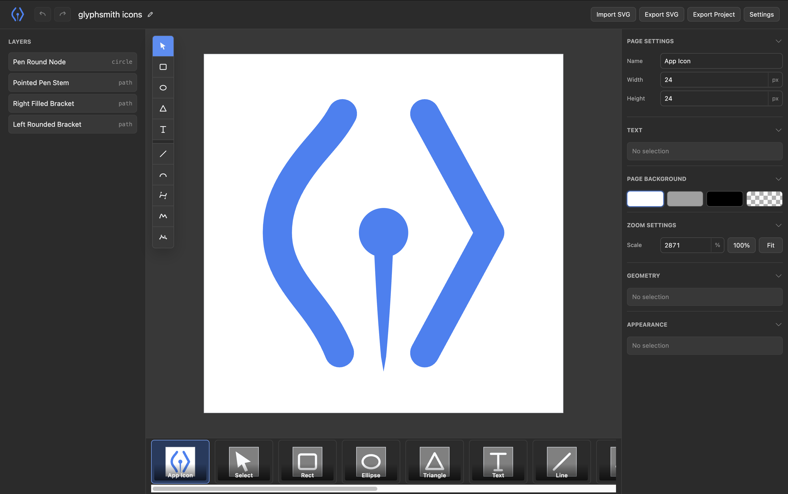

<p align="center">
  
</p>

<h1 align="center">GlyphSmith</h1>

<p align="center">
  Agent-native SVG editor powered by Geometry AST and patch-based editing.
</p>

GlyphSmith is an SVG editor designed for both manual editing and AI-assisted editing.
Instead of asking agents to rewrite whole SVG strings, GlyphSmith imports SVG into a Geometry AST,
applies targeted patch operations, and exports SVG only at the boundary.



```txt
SVG
↓ Import
Geometry AST
↓ Patch Operations
Geometry AST
↓ Export
SVG
```

## Status

GlyphSmith is in early development. The current release is CLI-first and focuses on local editor sessions, project files, SVG export, and MCP-based agent workflows.

## Quick Start

Install dependencies:

```sh
pnpm install
```

Run the default development project:

```sh
pnpm run dev
```

Development defaults:

```txt
Project: examples/playground.gs.json
UI:      http://localhost:6201
Host:    ws://localhost:6202/ws
MCP:     http://localhost:6202/mcp
```

Run the official GlyphSmith icon project:

```sh
pnpm run dev:icons
```

## Export Icons

Export the icon project into the web app static directory:

```sh
pnpm run export:icons
```

The generated SVG files are written to:

```txt
apps/web/static/icons
```

Running the command again overwrites the generated icon output.

## Agent Workflow

GlyphSmith keeps the Geometry AST as the source of truth. AI agents should modify projects through patch operations or MCP tools instead of regenerating SVG files.

Default local MCP endpoint:

```txt
http://127.0.0.1:6202/mcp
```

Register the local MCP endpoint:

```sh
glyphsmith mcp install codex --url http://127.0.0.1:6202/mcp
glyphsmith mcp install claude --url http://127.0.0.1:6202/mcp
```

Install GlyphSmith skills:

```sh
glyphsmith skills install codex
glyphsmith skills install claude
```

## Project Files

GlyphSmith project files use the `.gs.json` extension and can contain multiple pages. One page maps to one SVG-equivalent Geometry AST document.

Examples:

```txt
examples/playground.gs.json
examples/glyphsmith.gs.json
```

CLI path resolution is deterministic:

```txt
glyphsmith              -> ./glyphsmith.gs.json
glyphsmith logo         -> ./logo.gs.json
glyphsmith logo.gs.json -> ./logo.gs.json
```

If the resolved project file does not exist, the CLI creates it and continues.

## Repository Layout

```txt
apps/
├ cli/  Local host, CLI entrypoint, MCP coordination
└ web/  SvelteKit editor UI

packages/
├ ast/     Geometry AST definitions
├ editor/  Reusable editor interaction logic
├ kernel/  Geometry operations
├ mcp/     MCP server implementation
└ svg/     SVG import/export
```

## README Assets

README images live in `docs/images`. App runtime assets live in `apps/web/static`.

Current README assets:

```txt
docs/images/app-icon.svg
docs/images/editor.png
```
